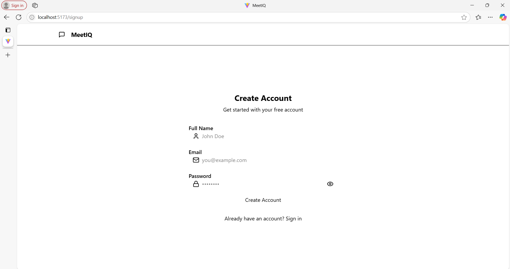
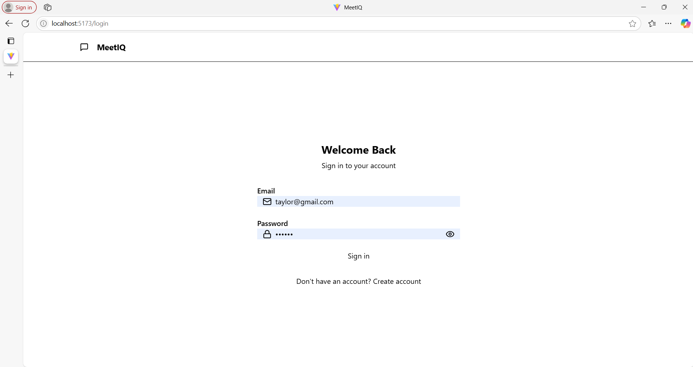
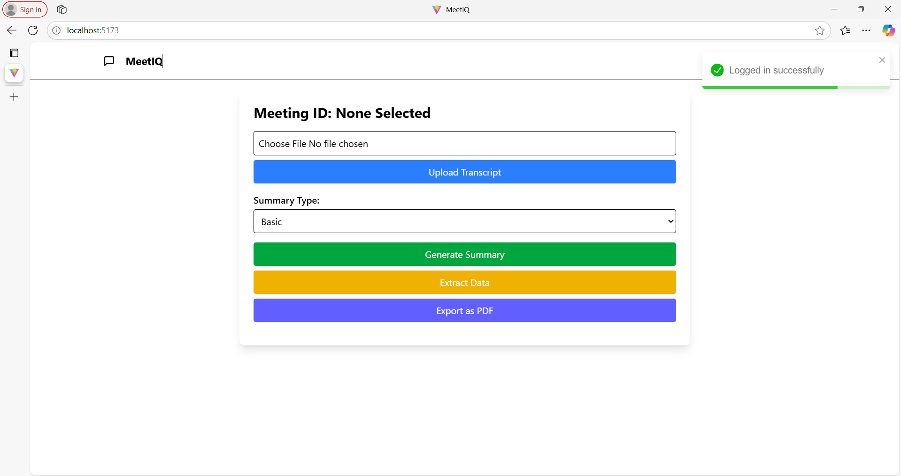
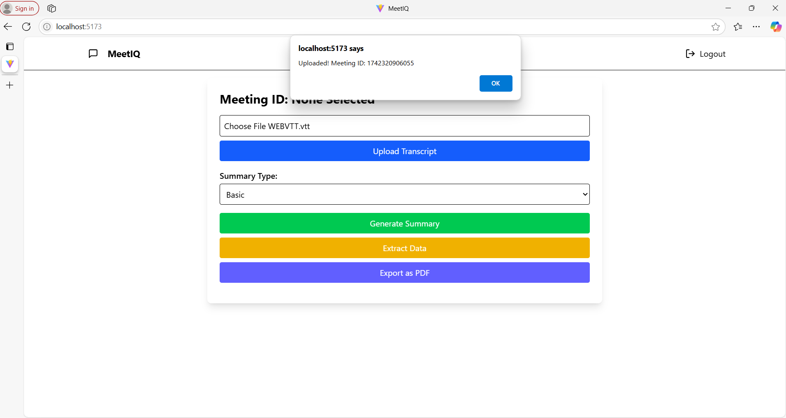
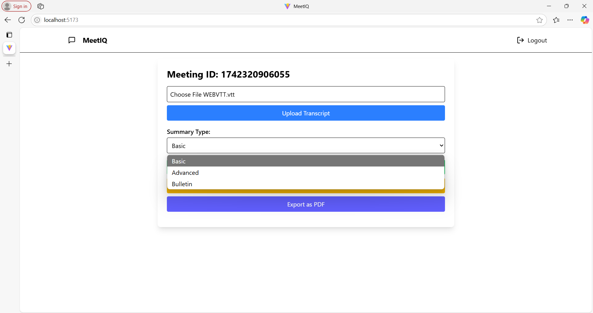
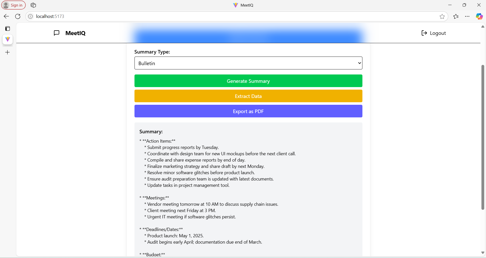
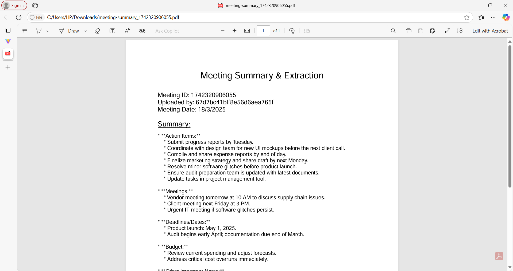

# MeetIQ

MeetIQ is an AI-powered solution that transforms raw meeting data into actionable insights. By automatically generating detailed summaries, extracting key keywords, and exporting results as PDFs, MeetIQ streamlines your meeting workflows while ensuring secure user authentication and an intuitive user experience.
## Features
- **Secure User Authentication:** Robust login, signup, and logout processes ensure that your data remains protected.
- **Dynamic Meeting Summaries:** Automatically generate multiple types of summaries tailored to your meeting's unique context.
- **Intelligent Keyword Extraction:** Identify the most important keywords and action items from your discussions.
- **PDF Export:** Easily download your meeting summaries as high-quality PDFs for sharing and record-keeping.
- **Effortless File Upload:** Quickly upload and process meeting data to kickstart the analysis.

## Technologies Used
- **Backend:**
  Node.js & Express.js: Core runtime and framework for building a robust server.
  MongoDB: A flexible NoSQL database for storing user and meeting data.
  Multer: Middleware for handling file uploads.
  JSON Web Tokens: Secure token-based authentication for managing user sessions.
  PDFKit: Generate dynamic PDFs of meeting summaries.

- **Frontend:**
  React & Vite: Fast, modern frameworks for building a responsive and efficient user interface.
  Tailwind CSS : Utility-first CSS frameworks for sleek, customizable designs.
  Zustand: Lightweight state management to handle application data seamlessly.


## Screenshots








## Installation

1. **Clone the Repository**
   ```bash
   git clone https://github.com/Tanvi-Ghadge/AI-Meeting-Analyzer.git
   cd AI-Meeting-Analyzer

2. **Setup the Backend**
   ```bash
   cd ../backend
   npm install
   npm start

4. **Setup the Frontend**
   ```bash
   cd ../frontend
   npm install
   npm run dev
   
6. **Usage:**
    Open your browser and visit http://localhost:8000 (or the correct port for your frontend).
    Register or log in to access the application.
    Upload meeting files, generate summaries, extract keywords, and export as PDF.
